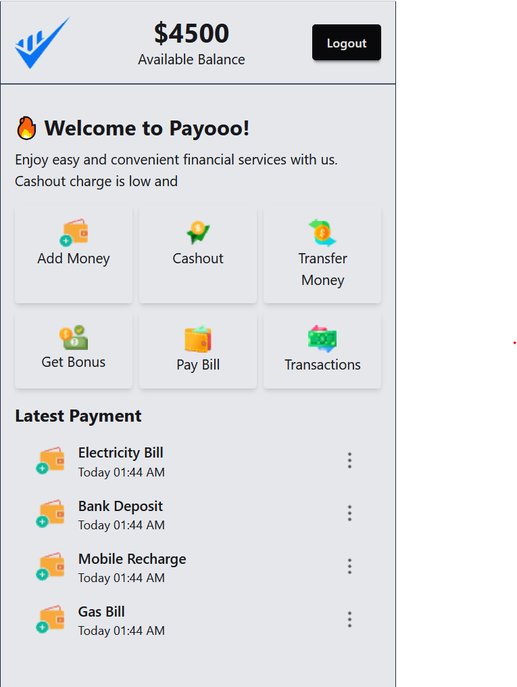

# 🏦 Bank UI Web App

A simple and elegant banking web interface created using **HTML**, **Tailwind CSS**, and **Vanilla JavaScript**. This project simulates basic banking features such as deposit, withdraw, and balance tracking — all done on the frontend.

🔗 **Live Demo:**  
👉 [bank.freelancerkhadiza.help](https://bank.freelancerkhadiza.help)


## 📸 Screenshot




## 🚀 Features

- 💰 Add Money (Deposit)
- 🧾 Withdraw Money
- 📊 Real-time Balance Update
- 🖥️ Clean, Minimal UI with Tailwind CSS
- 📱 Fully Responsive Design
- ⚡ Instant result without page reload


## 🛠️ Built With

- `HTML5`
- `Tailwind CSS`
- `JavaScript (Vanilla)`


## 🔧 How to Use Locally

1. Clone the repository:
   ```bash
   git clone https://github.com/khadizacoder/Bank.git
